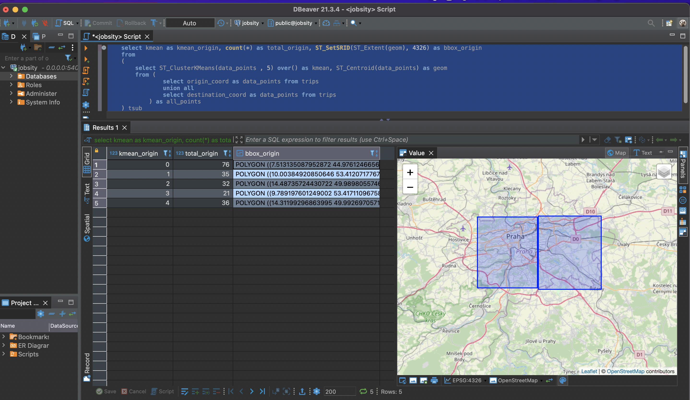

# Jobsity

Jobsity handles a complete streaming data stream from the information generation stage to the final consumer of message status and data analysis.

The project consists of 5 packages, all being orchestrated by the same docker-compose. The packages are as follows: 
- producer: this is the script responsible for simulating the creation of travel data that must be processed 
- api: It is an API responsible for receiving travel messages that must be submitted for processing in a queue.
- worker: Responsible for consuming the queue and performing the necessary processing to persist travel data.
- user_consumer: script responsible for simulating user waiting to receive messages about the status of processed data

## Installation

The entire system can be run from docker-compose.yml present in the project root. For this, Docker version 20.10.11 was used.

To upload the project, just run: 


```bash
docker compose up --build
```

## Usage

To submit a new dataset, just change the file present in **producer/data/trips.csv** with the new file. 

It is also possible to make a request **POST** for **0.0.0.0/trips** passing in the body the following text in json format:

```python
import requests

data = {
    "region":"Prague",
    "origin_coord":"POINT (14.4973794438195 50.00136875782316)",
    "destination_coord":"POINT (14.43109483523328 50.04052930943246)",
    "datetime":"2018-05-28 9:03:40",
    "datasource":"funny_car"
}
r = requests.post('http://0.0.0.0:8080/trips',data = data)
``` 
To access the data present in postgres, first open a bash in the database container with the following command:

```bash
docker exec -it jobsity-db-1  bash
```
Once that's done, run the connection with postgres: 

```
psql -h 0.0.0.0 -U postgres -d jobsity
```
Now just run any query you want. 

For external access to the container, use the following information: 
- **host**: 0.0.0.0.
- **port**: 0.0.0.0:5405
- **user**: postgres
- **password**: postgres_password
- **database**: jobsity

> **WARNING**: NEVER publish you database password on your documentation. I'm doing this because it's fake data and a test application.


## Implementation details

### Producer 

The producer is the script responsible for simulating the creation of travel data that must be processed. Two parameters are passed to this producer in docker-compose:
- STATUS: responsible for enabling or not triggering messages. Set as **"Online"** for the shot to be fired. Any other value will make the script behavior Offline, that is, not triggering any messages. 
- MULTIPLIER: this parameter multiplies the number of times that the script will process the sending of messages present in the CSV file present in ./producer/data/trips.csv. For example: if the file has 10 message lines, and the MULTIPLIER parameter is set to 20, we have 100 requests (10 lines*20 multiplier) will be triggered to the API.  

Test cases with greater volumetrics can be done either by increasing the number of records in the trips.csv file or by increasing the MULTIPLIER parameter. 

### API

It is an API responsible for receiving travel messages that must be submitted for processing in a queue. The responsibility of this service is to receive POST HTTP requests and queue the message that must be processed. The service responsible for managing the message list is the **Redis**, an open source (BSD licensed), in-memory data structure store, used as a database, cache, and message broker. 

Other services could be used for this step such as **Kafka**, a publish-subscribe messaging system. Depending on the implementation context and volumetry, it could be a better option. But for the purpose of simplifying the test implementation, Redis was chosen.

### Worker

Workers are responsible for consuming the queue and performing the necessary processing to persist travel data. In a productive environment, several instances could be used to parallel the processing of received data. This management can be done with Kubernetes, for example.

The worker performs two important tasks: Insert the received data into a database and send a message confirming whether or not to store the message. 

For storage, an **Postgres**  instance is used with **postgis** extension to work with geographic data. 

To send a message about the status of the message, the **Redis Pub/Sub**, that implements a Publish/Subscribe messaging paradigm. This paradigm shift is made to support the requirement of not using pulling to receive status messages. In this case, it is enough for the user to access the Redis subscriber in the channel where the messages are posted.As a solution, the **Kafka** could also meet this requirement. For reasons of test simplification, **Redis Pub/Sub** was chosen.

### User consumer

The script simulates a user waiting to receive messages about the status of processed data through subscribers of a messaging service. What this script does is basically receive the message and present its contents to the terminal.


### Missing features 

#### Data transformations for the analytics layer

For the analytical layer, it would be necessary to perform some transformations in order to improve the understanding of the business in addition to acquiring better performance in the visualization layer. For simplification purposes, operations could still be saved in postgres, but other solutions like Bigquery or Redshift are cloud solutions that could be used.

For orchestrating, testing and loading the transformed data, I would suggest the getDBT tool. getDBT, by themselves, "a transformation workflow that lets teams quickly and collaboratively deploy analytics code following software engineering best practices like modularity, portability, CI/CD, and documentation. Anyone who knows SQL can build production-grade data pipelines.". [Learn more about getDBT](https://www.getdbt.com/product/what-is-dbt/). 

For the two questions requested as features, the respective queries would serve as the basis for the transformations:

- Trips with similar origin, destination, and time of day should be grouped together
```SQL
/* 
 *  Trips with similar origin, destination, and time of day should be grouped together
 *  5 clusters was setting to exclude intersections and allow visualize some grouped data
 * For higher datasets, we can change the group by date(trip_datetime) to group by date(trip_datetime) and EXTRACT(hour FROM  trip_datetime)
 * */
select count(id) as qtd_trips,
        bbox_origin, 
        bbox_dest as bbox_destination , 
        date(trip_datetime)
from trips 
left join 
(
    select kmean as kmean_origin, count(*) as total_origin, ST_SetSRID(ST_Extent(geom), 4326) as bbox_origin 
    from
    (
        select ST_ClusterKMeans(data_points , 5) over() as kmean, ST_Centroid(data_points) as geom
        from (
                select origin_coord as data_points from trips 
                union all 
                select destination_coord as data_points from trips  
            ) as all_points 
    ) tsub
    group by kmean
)
 as clusters on  ST_Covers(ST_SetSRID(clusters.bbox_origin,4326),ST_SetSRID(trips.origin_coord,4326))
left join 
(
    select kmean as kmean_dest, count(*) as total_dest, ST_SetSRID(ST_Extent(geom), 4326) as bbox_dest
    from
    (
        select ST_ClusterKMeans(data_points , 5) OVER() as kmean, ST_Centroid(data_points) as geom
        from (
                select origin_coord as data_points from trips 
                union all 
                select destination_coord as data_points from trips  
            ) as all_points 
    ) tsub
    group by kmean
)
 as clusters_destination on  ST_Covers(ST_SetSRID(clusters_destination.bbox_dest,4326),ST_SetSRID(trips.destination_coord ,4326))

 group by bbox_origin, bbox_dest , date(trip_datetime) 
;
```

- Develop a way to obtain the weekly average number of trips for an area, defined by a bounding box (given by coordinates) or by a region

```SQL
/* 
 *  Develop a way to obtain the weekly average number of trips for an area, defined by a
 *	bounding box (given by coordinates) or by a region
 *  The boxes was created based in all data points to allow that all de boxes created was the same group of boxes for an origin or
 *  destination point classified.
 *  The quantity of clusters can be optimized or the algorithm can be change by a real division of the regions like neighborhoods
 * */
select 
	AVG(qtd_trips),
	region 
from (
		select  
			EXTRACT(WEEK from  trip_datetime) as week,
			region,
			COUNT(id) as qtd_trips
		from trips
		group by region , EXTRACT(WEEK from  trip_datetime) 
		
		) as q
group by region
```

Despite the queries being able to return the questions asked, some optimizations and decisions would need to be made such as materialization refresh interval, final table data model and partial materializations for performance purposes. In addition, resources such as indexes could be used on the base tables to optimize the queries made that would be heavier.

Executing these queries through DBeaver (a SQL client software application and a database administration tool), it is possible to visualize, albeit with limitations, both the boxes and the points saved in the database. In the image below, you can see an example: 



This tool was useful in the process of exploring and building the queries since the visualization step was not completed.

#### Visualization tool 

As a visualization tool, QGis is an open source tool that meets the requirements of geographic data visualizations very well, although with some usability and exploration limitations for the end user.

With business users in mind, some adaptations such as defining data in neighborhood-based boxes would facilitate compatibility with other more intuitive visualization tools such as Tableau, Looker or Metabase.